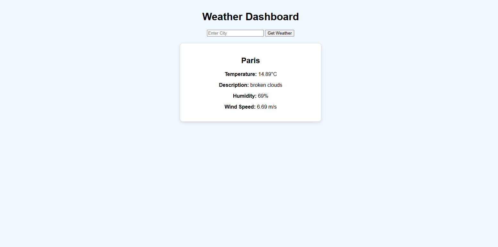

Projet : Weather Dashboard app
Description : A simple web application that allows users to search for the current weather in any city using the OpenWeatherMap API.
## Features
- Search for current weather by city name
- Display temperature, humidity, and weather conditions
## Technologies Used
- Python
- Flask
- Requests
## Setup Instructions
1. Clone the repository
2. Navigate to the project directory
3. Create a virtual environment and activate it
4. Install the required dependencies using `pip install -r requirements.txt`
5. Set the `OPENWEATHER_API_KEY` environment variable with your OpenWeatherMap API key
6. Run the Flask application using `python app.py`
7. Open a web browser and go to `http://localhost:5000` to use the app
## License
This project is licensed under the MIT License. See the LICENSE file for details.
## Acknowledgements
- OpenWeatherMap for providing the weather data API
- Flask for the web framework
- Requests for making HTTP requests to the API

